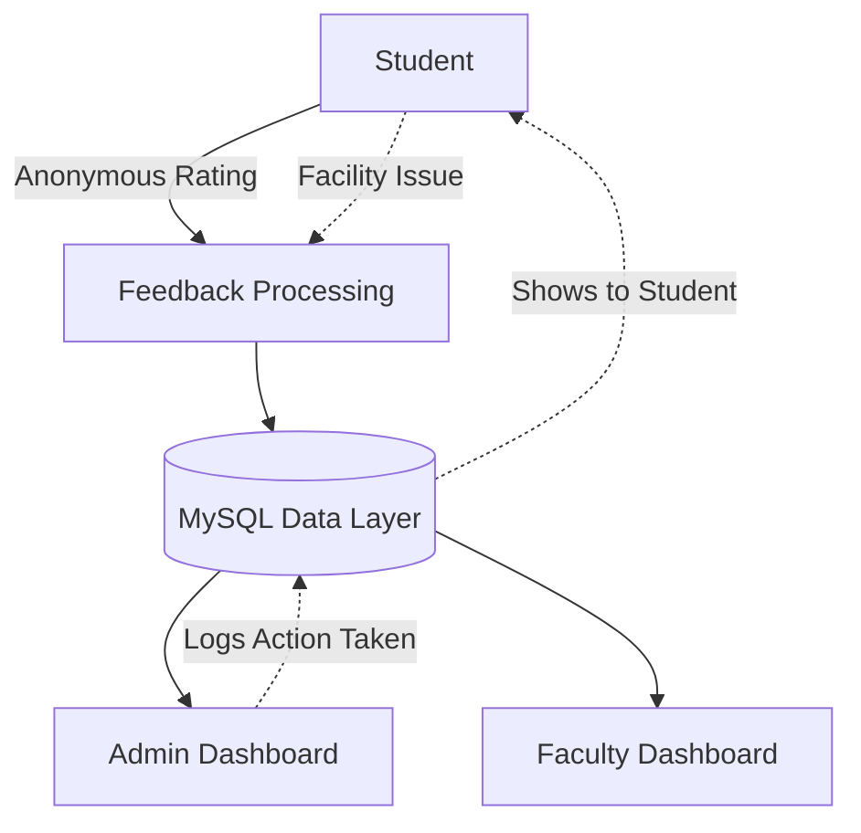

# 📚 Smart Student Feedback & Campus Facility System

A comprehensive, full-stack web application for **anonymous student feedback**, tailored not just for academic courses but also for campus facilities like Hostels, Mess, and Restrooms. Features role-based dashboards, multi-dimensional analytics, and tracked system improvements.


---

## ✨ Key Features

### 🎓 Student Experience
- **Course Feedback:** Submit anonymous ratings (1-5) and comments per academic course.
- **Campus Facility Feedback [NEW]:** Rate and comment on college facilities (Hostel, Mess, Wi-Fi, Restrooms, etc.).
- **Suggestions:** Drop general improvement ideas for both academics and facilities.
- **Double-Blind Integrity:** Tracks submissions to prevent duplicates without tying students perfectly to their feedback.

### 👨‍🏫 Faculty Dashboard
- **Course Analytics:** View average ratings, top comments, and distribution charts for assigned courses.
- **Weekly Trends:** Visual tracking of feedback volume and sentiment over time.
- **AI-Ready Text Summaries:** Read quick generated summaries of course performance.

### 🛠️ Admin Command Center
- **Holistic Overviews:** Combined views of all course AND campus facility sentiments.
- **Action Tracking Engine:** When a suggestion is dropped, admins can track "Resolution Actions" (Pending -> In Progress -> Resolved).
- **Course Management:** Add courses and dynamically assign them to registered faculty.

---

## 🏗️ Core Architecture



---

## 🚀 Setup & Launch

### 1. Database Provisioning
This uses MySQL. In your terminal or Workbench, run the schema file which creates tables and seeds default Indian sample data.
```bash
mysql -u root -p < database/schema.sql
```

### 2. Environment Config
Navigate to `backend/` and copy `.env.example` to `.env`. Update your credentials:
```env
DB_HOST=localhost
DB_PORT=3306
DB_USER=root
# DB_PASSWORD=your_password
DB_NAME=student_feedback_db
JWT_SECRET=your_secret_key
PORT=5002
```

### 3. Install & Seed
Seed logic auto-hashes the passwords using `bcryptjs`.
```bash
cd backend
npm install
node utils/seed.js
```

### 4. Run the Dev Server
```bash
npm run dev
```

---

## 🔐 Demo Credentials

Use these seeded accounts to test different roles (Password for all: `student123` / `faculty123` / `admin123` based on role):

| Role    | Name | Email               | Password   |
| ------- | ---- |------------------- | ---------- |
| **Admin**   | Admin | `admin@college.com`   | `admin123`   |
| **Faculty** | Dr. Ramesh | `ramesh@college.com`   | `faculty123` |
| **Faculty** | Dr. Priya | `priya@college.com` | `faculty123` |
| **Student** | Abishek | `ram@student.com`   | `student123` |
| **Student** | Kavitha | `kavitha@student.com`     | `student123` |

---

## 📊 Database Schema Highlights

- `users (role enum)`
- `courses` & `facilities` [NEW]
- `feedback (course_id OR facility_id)`
- `feedback_tracking (student_id + target_id unique constraint)`
- `actions (status enum)`

## ☁️ Render Deployment - https://student-feedback-management.onrender.com
